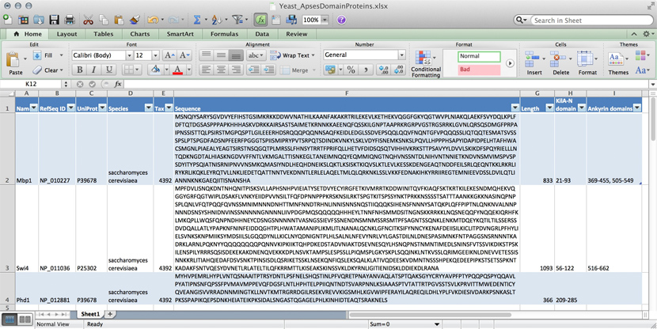
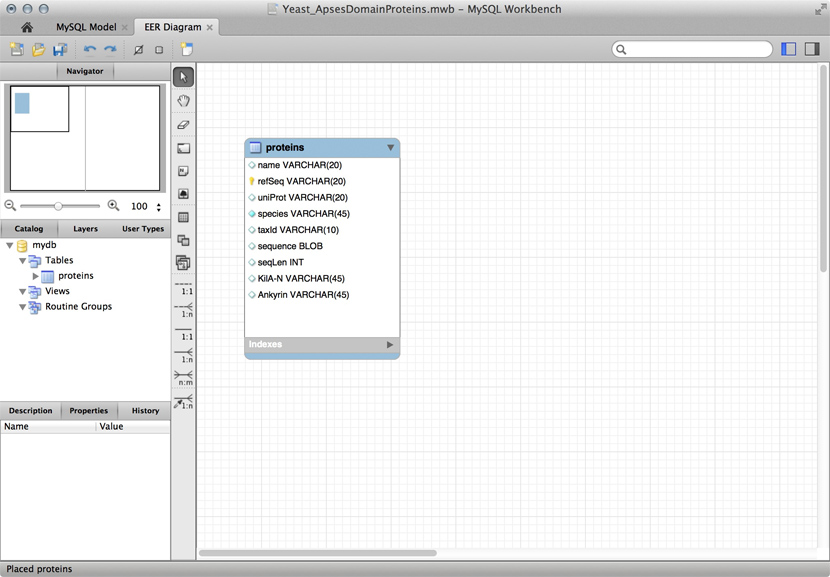
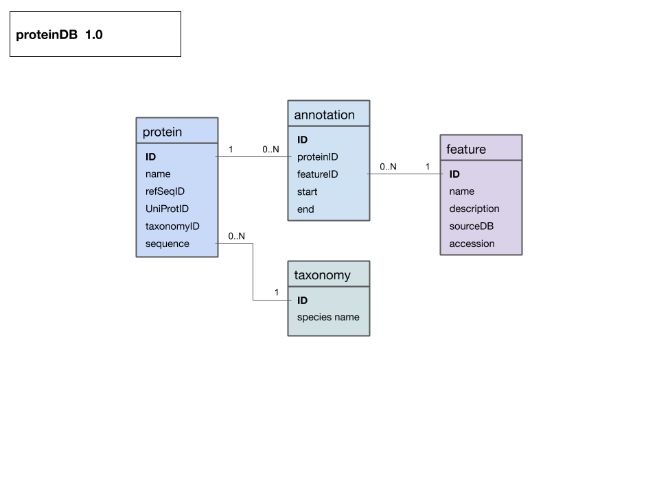

# Storing Data {#storing-data}
(Representation of data; common data formats; implementing a data model; JSON.)

## Overview

###Abstract:

This unit discusses options for storing and organizing data in a variety of formats, and develops R code for a protein data model, based on JSON formatted source data.

### Objectives:

This unit will:

  * Introduce principles of storing data in different formats and principles of supporting storage, maintenance, and retrieval with different tools;
  * Implement relational data models as lists of data frames in R;
  * Develop code for this purpose and teach how to work with such code;
  * Find the closest homologue of Mbp1 in MYSPE.

### Outcomes:

After working through this unit you:

  * can recommend alternatives for storing data, depending on the context and objectives;
  * can create, edit and validate JSON formatted data;
  * have practiced creating a relational database as a list of dataframes;
  * can query the database directly, and via cross-referenc ing tables;
  * have discovered the closest homologue to yeast Mbp1 in MYSPE;
  * have added key information about this protein to the database;

### Deliverables:
**Time management**: Before you begin, estimate how long it will take you to complete this unit. Then, record in your course journal: the number of hours you estimated, the number of hours you worked on the unit, and the amount of time that passed between start and completion of this unit.

**Journal**: Document your progress in your Course Journal. Some tasks may ask you to include specific items in your journal. Don't overlook these.

**Insights**: If you find something particularly noteworthy about this unit, make a note in your insights! page.

### Prerequisites:

This unit builds on material covered in the following prerequisite units:

[BIN-Abstractions (Abstractions for Bioinformatics)](#abstractions)

 

## Evaluation

This learning unit can be evaluated for a maximum of 6 marks. If you want to submit the tasks for this unit for credit:

  * Create a new page on the student Wiki as a subpage of your User Page.
  * There are a number of tasks in which you are explicitly asked you to submit code or other text for credit. Put all of these submission on this one page.
When you are done with everything, add the following category tag to the end of page:[[Category:EVAL-BIN-Storing_data]].
  * **Once the page has been saved with this tag, it is considered "submitted". Do not change your submission after this tag has been added. The page will be marked and the category tag will be removed by the instructor.**

`r task_counter <- task_counter + 1`
## Task `r task_counter`

```{block, type="rmd-task"}
Read the introductory notes on concepts about [storing data for bioinformatics](boris_docs/BIN_Storing_data.pdf).
```
 
Any software project requires modelling on many levels - data-flow models, logic models, user interaction models and more. But all of these ultimately rely on a data model that defines how the world is going to be represented in the computer for the project's purpose. The process of abstraction of data entities and defining their relationships can (and should) take up a major part of the project definition, often taking several iterations until you get it right. Whether your data can be completely described, consistently stored and efficiently retrieved is determined to a large part by your data model.

Databases can take many forms, from memories in your brain, to shoe-cartons under your bed, to software applications on your computer, or warehouse-sized data centres. Fundamentally, these all do the same thing: collect information and make it available.

Let us consider collecting information on APSES-domain transcription factors in various fungi, with the goal of being able to compare them. Let's specify this as follows:

Store data on APSES-domain proteins so that we can
  * cross reference the source databases;
  * study if they have the same features (e.g. domains);and compare the features.
  * The underlying information can easily be retrieved for a protein from its RefSeq or UniProt entry.


## Text files

A first attempt to organize the data might be simply to write it down as text:

name: Mbp1
refseq ID: NP_010227
uniprot ID: P39678
species: Saccharomyces cerevisiae
taxonomy ID: 4392
sequence:
MSNQIYSARYSGVDVYEFIHSTGSIMKRKKDDWVNATHILKAANFAKAKR
TRILEKEVLKETHEKVQGGFGKYQGTWVPLNIAKQLAEKFSVYDQLKPLF
DFTQTDGSASPPPAPKHHHASKVDRKKAIRSASTSAIMETKRNNKKAEEN
QFQSSKILGNPTAAPRKRGRPVGSTRGSRRKLGVNLQRSQSDMGFPRPAI
PNSSISTTQLPSIRSTMGPQSPTLGILEEERHDSRQQQPQQNNSAQFKEI
DLEDGLSSDVEPSQQLQQVFNQNTGFVPQQQSSLIQTQQTESMATSVSSS
PSLPTSPGDFADSNPFEERFPGGGTSPIISMIPRYPVTSRPQTSDINDKV
NKYLSKLVDYFISNEMKSNKSLPQVLLHPPPHSAPYIDAPIDPELHTAFH
WACSMGNLPIAEALYEAGTSIRSTNSQGQTPLMRSSLFHNSYTRRTFPRI
FQLLHETVFDIDSQSQTVIHHIVKRKSTTPSAVYYLDVVLSKIKDFSPQY
RIELLLNTQDKNGDTALHIASKNGDVVFFNTLVKMGALTTISNKEGLTAN
EIMNQQYEQMMIQNGTNQHVNSSNTDLNIHVNTNNIETKNDVNSMVIMSP
VSPSDYITYPSQIATNISRNIPNVVNSMKQMASIYNDLHEQHDNEIKSLQ
KTLKSISKTKIQVSLKTLEVLKESSKDENGEAQTNDDFEILSRLQEQNTK
KLRKRLIRYKRLIKQKLEYRQTVLLNKLIEDETQATTNNTVEKDNNTLER
LELAQELTMLQLQRKNKLSSLVKKFEDNAKIHKYRRIIREGTEMNIEEVD
SSLDVILQTLIANNNKNKGAEQIITISNANSHA
length: 833
Kila-N domain: 21-93
Ankyrin domains: 369-455, 505-549
...

... and save it all in one large text file and whenever you need to look something up, you just open the file, look for e.g. the name of the protein and read what's there. Or - for a more structured approach, you could put this into several files in a folder.^[Your operating system can help you keep the files organized. The "file system" is a database.] This is a perfectly valid approach and for some applications it might not be worth the effort to think more deeply about how to structure the data, and store it in a way that it is robust and scales easily to large datasets. Alas, small projects have a tendency to grow into large projects and if you work in this way, it's almost guaranteed that you will end up doing many things by hand that could easily be automated. Imagine asking questions like:

  * How many proteins do I have?
  * What's the sequence of the Kila-N domain?
  * What percentage of my proteins have an Ankyrin domain?
  * Or two ...?

Answering these questions "by hand" is possible, but tedious.

## Spreadsheets

Data for three yeast APSES domain proteins in an Excel spreadsheet.



Many serious researchers keep their project data in spreadsheets. Often they use Excel, or an alternative like the free [OpenOffice Calc](https://www.openoffice.org/product/calc.html), or [Google Sheets](https://www.google.ca/sheets/about/), both of which are compatible with Excel and have some interesting advantages. Here, all your data is in one place, easy to edit. You can even do simple calculations - although you should never use Excel for statistics^[For real: Excel is miserable and often wrong on statistics, and it makes horrible, ugly plots. See [here](http://www.practicalstats.com/xlstats/excelstats.html) and [here](https://www.burns-stat.com/documents/tutorials/spreadsheet-addiction/) why Excel problems are not merely cosmetic.]. You could answer What percentage of my proteins have an Ankyrin domain? quite easily^[At the bottom of the window there is a menu that says "sum = ..." by default. This provides simple calculations on the selected range. Set the choice to "count", select all Ankyrin domain entries, and the count shows you how many cells actually have a value.].

There are two major downsides to spreadsheets. For one, complex queries need programming. There is no way around this. You can program inside Excel with Visual Basic. But you might as well export your data so you can work on it with a "real" programming language. The other thing is that Excel does not scale very well. Once you have more than a hundred proteins in your spreadsheet, you can see how finding anything can become tedious.

However, just because it was built for business applications, and designed for use by office assistants, does not mean it is intrinsically unsuitable for our domain. It's important to be pragmatic, not dogmatic, when choosing tools: choose according to your real requirements. Sometimes "quick and dirty" is just fine, because quick.


 
## R

R can keep complex data in data frames and lists. If we do data analysis with R, we have to load the data first. We can use any of the read.table() functions for structured data, read lines of raw text with readLines(), or slurp in entire files with scan(). Convenient packages exist to parse structured data like XML or JSON and import it. But we could also keep the data in an R object in the first place that we can read from disk, analyze, modify, and write back. In this case, R becomes our database engine.

```{r}
# Sample construction of an R database table as a dataframe
 
# Data for the Mbp1 protein
proteins <- data.frame(
    name     = "Mbp1",
    refSeq   = "NP_010227",
    uniProt  = "P39678",
    species  = "Saccharomyces cerevisiae",
    taxId    = "4392",
    sequence = paste(
                    "MSNQIYSARYSGVDVYEFIHSTGSIMKRKKDDWVNATHILKAANFAKAKR",
                    "TRILEKEVLKETHEKVQGGFGKYQGTWVPLNIAKQLAEKFSVYDQLKPLF",
                    "DFTQTDGSASPPPAPKHHHASKVDRKKAIRSASTSAIMETKRNNKKAEEN",
                    "QFQSSKILGNPTAAPRKRGRPVGSTRGSRRKLGVNLQRSQSDMGFPRPAI",
                    "PNSSISTTQLPSIRSTMGPQSPTLGILEEERHDSRQQQPQQNNSAQFKEI",
                    "DLEDGLSSDVEPSQQLQQVFNQNTGFVPQQQSSLIQTQQTESMATSVSSS",
                    "PSLPTSPGDFADSNPFEERFPGGGTSPIISMIPRYPVTSRPQTSDINDKV",
                    "NKYLSKLVDYFISNEMKSNKSLPQVLLHPPPHSAPYIDAPIDPELHTAFH",
                    "WACSMGNLPIAEALYEAGTSIRSTNSQGQTPLMRSSLFHNSYTRRTFPRI",
                    "FQLLHETVFDIDSQSQTVIHHIVKRKSTTPSAVYYLDVVLSKIKDFSPQY",
                    "RIELLLNTQDKNGDTALHIASKNGDVVFFNTLVKMGALTTISNKEGLTAN",
                    "EIMNQQYEQMMIQNGTNQHVNSSNTDLNIHVNTNNIETKNDVNSMVIMSP",
                    "VSPSDYITYPSQIATNISRNIPNVVNSMKQMASIYNDLHEQHDNEIKSLQ",
                    "KTLKSISKTKIQVSLKTLEVLKESSKDENGEAQTNDDFEILSRLQEQNTK",
                    "KLRKRLIRYKRLIKQKLEYRQTVLLNKLIEDETQATTNNTVEKDNNTLER",
                    "LELAQELTMLQLQRKNKLSSLVKKFEDNAKIHKYRRIIREGTEMNIEEVD",
                    "SSLDVILQTLIANNNKNKGAEQIITISNANSHA",
                    sep=""),
    seqLen   = 833,
    KilAN    = "21-93",
    Ankyrin  = "369-455, 505-549",
    stringsAsFactors = FALSE)
```

```{r}
# add data for the Swi4 protein
proteins <- rbind(proteins,
                  data.frame(
    name     = "Swi4",
    refSeq   = "NP_011036",
    uniProt  = "P25302",
    species  = "Saccharomyces cerevisiae",
    taxId    = "4392",
    sequence = paste(
                    "MPFDVLISNQKDNTNHQNITPISKSVLLAPHSNHPVIEIATYSETDVYEC",
                    "YIRGFETKIVMRRTKDDWINITQVFKIAQFSKTKRTKILEKESNDMQHEK",
                    "VQGGYGRFQGTWIPLDSAKFLVNKYEIIDPVVNSILTFQFDPNNPPPKRS",
                    "KNSILRKTSPGTKITSPSSYNKTPRKKNSSSSTSATTTAANKKGKKNASI",
                    "NQPNPSPLQNLVFQTPQQFQVNSSMNIMNNNDNHTTMNFNNDTRHNLINN",
                    "ISNNSNQSTIIQQQKSIHENSFNNNYSATQKPLQFFPIPTNLQNKNVALN",
                    "NPNNNDSNSYSHNIDNVINSSNNNNNGNNNNLIIVPDGPMQSQQQQQHHH",
                    "EYLTNNFNHSMMDSITNGNSKKRRKKLNQSNEQQFYNQQEKIQRHFKLMK",
                    "QPLLWQSFQNPNDHHNEYCDSNGSNNNNNTVASNGSSIEVFSSNENDNSM",
                    "NMSSRSMTPFSAGNTSSQNKLENKMTDQEYKQTILTILSSERSSDVDQAL",
                    "LATLYPAPKNFNINFEIDDQGHTPLHWATAMANIPLIKMLITLNANALQC",
                    "NKLGFNCITKSIFYNNCYKENAFDEIISILKICLITPDVNGRLPFHYLIE",
                    "LSVNKSKNPMIIKSYMDSIILSLGQQDYNLLKICLNYQDNIGNTPLHLSA",
                    "LNLNFEVYNRLVYLGASTDILNLDNESPASIMNKFNTPAGGSNSRNNNTK",
                    "ADRKLARNLPQKNYYQQQQQQQQPQNNVKIPKIIKTQHPDKEDSTADVNI",
                    "AKTDSEVNESQYLHSNQPNSTNMNTIMEDLSNINSFVTSSVIKDIKSTPS",
                    "KILENSPILYRRRSQSISDEKEKAKDNENQVEKKKDPLNSVKTAMPSLES",
                    "PSSLLPIQMSPLGKYSKPLSQQINKLNTKVSSLQRIMGEEIKNLDNEVVE",
                    "TESSISNNKKRLITIAHQIEDAFDSVSNKTPINSISDLQSRIKETSSKLN",
                    "SEKQNFIQSLEKSQALKLATIVQDEESKVDMNTNSSSHPEKQEDEEPIPK",
                    "STSETSSPKNTKADAKFSNTVQESYDVNETLRLATELTILQFKRRMTTLK",
                    "ISEAKSKINSSVKLDKYRNLIGITIENIDSKLDDIEKDLRANA",
                    sep=""),
    seqLen   = 1093,
    KilAN    = "56-122",
    Ankyrin  = "516-662",
    stringsAsFactors = FALSE)
    )
```

```{r}
# how many proteins?
nrow(proteins)
```
 
```{r}
#what are their names?
proteins[,"name"]
```

 
```{r}
# how many do not have an Ankyrin domain?
sum(proteins[,"Ankyrin"] == "")
```

```{r}
# save it to file
save(proteins, file="proteinData.Rda")
```
 

```{r}
# delete it from memory
rm(proteins)
```
 
```{r}
# check...
if(!exists("proteins")){
  paste("Error: object 'proteins' not found")
}  # ... yes, it's gone
```

```{r}
 
# read it back in:
load("proteinData.Rda")
```
 
```{r}
# did this work?
sum(proteins[,"seqLen"])   # 1926 amino acids

 
# [END]
```

The third way to use **R** for data is to connect it to a "real" database:

  * a relational database like [mySQL](https://en.wikipedia.org/wiki/MySQL), [MariaDB](https://en.wikipedia.org/wiki/MariaDB), or [PostgreSQL](https://en.wikipedia.org/wiki/PostgreSQL);
  * an object/document database like {{WP|MongoDB};
  * or even a graph-database like [Neo4j](https://en.wikipedia.org/wiki/Neo4j).

**R** "drivers" are available for all of these. However all of these require installing extra software on your computer: the actual database, which runs as an independent application. If you need a rock-solid database with guaranteed integrity, multi-user support, ACID transactional gurantees, industry standard performance, and scalability to even very large datasets, don't think of rolling your own solution. One of the above is the way to go.


 
## MySQL and friends

A "Schema" for a table that stores data for APSES domain proteins. This is a screenshot of the free MySQL Workbench application.

MySQL is a free, open relational database that powers some of the largest corporations as well as some of the smallest laboratories. It is based on a client-server model. The database engine runs as a daemon in the background and waits for connection attempts. When a connection is established, the server process establishes a communication session with the client. The client sends requests, and the server responds. One can do this interactively, by running the client program /usr/local/mysql/bin/mysql (on Unix systems). Or, when you are using a program such as **R**, Python, Perl, etc. you use the appropriate method calls or functions—the driver—to establish the connection.

These types of databases use their own language to describe actions: SQL - which handles data definition, data manipulation, and data control.

Just for illustration, the Figure above shows a table for our APSES domain protein data, built as a table in the MySQL workbench application and presented as an Entity Relationship Diagram (ERD). There is only one entity though - the protein "table". The application can generate the actual code that implements this model on a SQL compliant database:

```{sql eval=FALSE}
CREATE TABLE IF NOT EXISTS `mydb`.`proteins` (
  `name` VARCHAR(20) NULL,
  `refSeq` VARCHAR(20) NOT NULL,
  `uniProt` VARCHAR(20) NULL,
  `species` VARCHAR(45) NOT NULL COMMENT '	',
  `taxId` VARCHAR(10) NULL,
  `sequence` BLOB NULL,
  `seqLen` INT NULL,
  `KilA-N` VARCHAR(45) NULL,
  `Ankyrin` VARCHAR(45) NULL,
  PRIMARY KEY (`refSeq`))
ENGINE = InnoDB
```


This looks at least as complicated as putting the model into **R** in the first place. Why then would we do this, if we need to load it into **R** for analysis anyway. There are several important reasons.

  * **Scalability**: these systems are built to work with very large datasets and optimized for performance. In theory **R** has very good performance with large data objects, but not so when the data becomes larger than what the computer can keep in memory all at once.
  * **Concurrency**: when several users need to access the data potentially at the same time, you must use a "real" database system. Handling problems of concurrent access is what they are made for.
  * **ACID compliance**. [ACID](https://en.wikipedia.org/wiki/ACID) describes four aspects that make a database robust, these are crucial for situations in which you have only partial control over your system or its input, and they would be quite laborious to implement for your hand built **R** data model:
    **Atomicity**: Atomicity requires that each transaction is handled "indivisibly": it either succeeds fully, with all requested elements, or not at all.
    **Consistency**: Consistency requires that any transaction will bring the database from one valid state to another. In particular any data-validation rules have to be enforced.
    **Isolation**: Isolation ensures that any concurrent execution of transactions results in the exact same database state as if transactions would have been executed serially, one after the other.
    **Durability**: The Durability requirement ensures that a committed transaction remains permanently committed, even in the event that the database crashes or later errors occur. You can think of this like an "autosave" function on every operation.

All the database systems I have mentioned above are ACID compliant^[For a list of relational Database Management Systems, see [here](https://en.wikipedia.org/wiki/Https://en.wikipedia.org/wiki/Comparison_of_relational_database_management_systems).].

Incidentally - we are looking forward to RStudio 1.1 with it's promise to bring R syntax to the interaction with SQL databases, removing another barrier.


 
## Store Data
 
### A protein datamodel

Entity-Relationship Diagram (ERD) for a protein data model that includes protein, taxonomy and feature annotations. Entity names are at the top of each box, attributes are listed below. If you think of an entity as an **R** dataframe, or a spreadsheet table, the attributes are the column names and each specific instance of an entity fills one row (or "record").All relationships link to unique primary keys and are thus 1 to (0, n). The diagram was drawn as a ["Google drawing"](https://docs.google.com/drawings/d/1uupNvz18_FYFwyyVPebTM0CUxcJCPDQuxuIJGpjWQWg/edit) and you can view it on the Web and make a copy for your own purposes.

### Implementing the Data Model in R
 
To actually implement the data model in **R** we will create the tables as data frames, and we will collect them in a list. We don't have to keep the tables in a list - we could also keep them as independent objects, but a list is neater, more flexible (we might want to have several of these), it reflects our intent about the model better, and doesn't require very much more typing.


`r task_counter <- task_counter + 1`
## Task `r task_counter`

```{block, type="rmd-task"}

  * Open RStudio and load the ABC-units R project. If you have loaded it before, choose File → Recent projects → ABC-Units. If you have not loaded it before, follow the instructions in the [RPR-Introduction unit](http://steipe.biochemistry.utoronto.ca/abc/index.php/RPR-Introduction).
  * Choose Tools → Version Control → Pull Branches to fetch the most recent version of the project from its GitHub repository with all changes and bug fixes included.
  * Type init() as requested.
  * Open the file BIN-Storing_data.R and follow the instructions.
 
**Note**: take care that you understand all of the code in the script. Evaluation in this course is cumulative and you may be asked to explain any part of code.
```

 

 


## Further reading, links and resources
  * [Database normalization](https://en.wikipedia.org/wiki/Database_normalization)
  * [Overview of data model types (Lucidchart)](https://www.lucidchart.com/pages/database-diagram/database-models)

 


 
**If in doubt, ask!**<br>
If anything about this learning unit is not clear to you, do not proceed blindly but ask for clarification. Post your question on the course mailing list: others are likely to have similar problems. Or send an email to your instructor.

```{block2, type="rmd-original-history"}
<br>**Author**: Boris Steipe <boris.steipe@utoronto.ca> <br>
**Created**: 2017-08-05<br>
**Modified**: 2017-09-22<br>
Version: 1.0.1<br>
**Version history**:<br>
1.0.1 Add link to data model types overview<br>
1.0 Completed to first live version<br>
0.1 First stub<br>
``` 
 