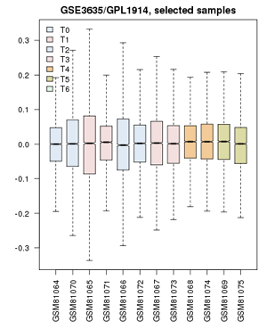

# Discovering Differentially Expressed Genes {#de-genes}
(Discovering differentially expressed genes)

## Overview
###Abstract:
Discovering differentially expressed genes in a yeast cell cycle dataset.

### Objectives:
This unit will:

  * introduce the GEO tools to evaluate differentially expressed genes.

### Outcomes:

After working through this unit you:

  * can access GEO, search for relevant datasets and find significantly differentially expressed genes in the data.
  
### Deliverables:
**Time management**: Before you begin, estimate how long it will take you to complete this unit. Then, record in your course journal: the number of hours you estimated, the number of hours you worked on the unit, and the amount of time that passed between start and completion of this unit.

**Journal**: Document your progress in your Course Journal. Some tasks may ask you to include specific items in your journal. Don't overlook these.

**Insights**: If you find something particularly noteworthy about this unit, make a note in your insights! page.

### Prerequisites:

You need the following preparation before beginning this unit. If you are not familiar with this material from courses you took previously, you need to prepare yourself from other information sources:

The Central Dogma: Regulation of transcription and translation; protein biosynthesis and degradation; quality control.
This unit builds on material covered in the following prerequisite units:

[BIN-EXPR-GEO (The NCBI GEO Gene Expression database)](#geo)

`r task_counter <- task_counter + 1`
## Task `r task_counter`

```{block, type="rmd-task"}
Read the introductory notes on [discovering differentially expressed genes in high-throughput data](boris_docs/BIN-EXPR-DE.pdf).
```
 
## GEO2R

Let's look at differential expression of Mbp1 and its target genes using the analysis facilities of the GEO database at the NCBI.

```{block, type="rmd-task"}
**First, we will search for relevant data sets on GEO, the NCBI's database for expression data.**

  1. Navigate to the entry page for [GEO data sets](https://www.ncbi.nlm.nih.gov/gds/).
  1. Enter the following query in the usual Entrez query format: "cell cycle"[ti] AND "saccharomyces cerevisiae"[organism].
  1. You should get two datasets among the top hits that analyze wild-type yeast (W303a cells) across two cell-cycles after release from alpha-factor arrest. Choose the [experiment with lower resolution](https://www.ncbi.nlm.nih.gov/sites/GDSbrowser?acc=GDS2347) (13 samples).
  1. On the linked GEO DataSet Browser page, follow the link to the [Accession Viewer page: the "Reference series"](https://www.ncbi.nlm.nih.gov/geo/query/acc.cgi?acc=GSE3635).
  1. Read about the experiment and samples, then follow the link to [analyze with GEO2R](https://www.ncbi.nlm.nih.gov/geo/geo2r/?acc=GSE3635)

  * View the [GEO2R video tutorial](https://www.youtube.com/watch?v=EUPmGWS8ik0) on youtube.

**Now proceed to apply this to the yeast cell-cycle study**


  1. **Define groups**: the associated publication shows us that one cell-cycle takes pretty exactly 60 minutes. Create timepoints T0, T1, T2, ... T5. Then associate the 0 and 60 min. sample with "T0"; 10 and 70 minutes get grouped as "T1"; 20 and 80 minutes are T2, etc. up to T5. The final sample does not get assigned.
  1. Confirm that the **Value distributions** are unbiased by accessing the value distribution tab - overall, in such experiments, the bulk of the expression values should not change and thus means and quantiles of the expression levels should be about the same.
  1. Your distribution should look like the image below: properly grouped into six categories, and unbiased regarding absolute expression levels and trends.
  1. **Look for differentially expressed genes**: open the GEO2R tab and click on Top 250.

**Analyze the results.**

  1. Examine the top hits. Click on a few of the gene names in the Gene.symbol column to view the expression profiles that tell you why the genes were found to be differentially expressed. What do you think? Is this what you would have expected for genes' responses to the cell-cycle? What seems to be the algorithm's notion of what "differentially expressed" means?
  1. Look for expected genes. Here are a few genes that are known to be differentially expressed in the cell-cycle as target genes of the MBF complex: DSE1, DSE2, ERF3, HTA2, HTB2, and GAS3. But what about the MBD complex proteins themselves: Mbp1 and Swi6?

The notion of "differential expression" and "cell-cycle dependent expression" do not overlap completely. Significant differential expression is mathematically determined for genes that have **low variance within groups and large differences between groups**. The algorithm has no concept of any expectation you might have about the shape of the expression profile. All it finds are genes for which differential expression between some groups is statistically supported. The algorithm returns the top 250 of those. Consistency within groups is very important, while we intuitively might be giving more weight to genes that conform to our expectations of a cyclical pattern.

Let's see if we can group our time points differently to enhance the contrast between expression levels for cyclically expressed genes. Let's define only two groups: one set before and between the two cycles, one set at the peaks - and we'll omit some of the intermediate values.

  1. Remove all of your groups and define two groups only. Call them "A" and "B".
  1. Assign samples for T = 0 min, 10, 60 and 70 min. to the "A" group. Assign sets 30, 40, 90, and 100 to the "B" group.
  1. Recalculate the Top 250 differentially expressed genes (you might have to refresh the page to get the "Top 250" button back.) Which of the "known" MBF targets are now contained in the set? What about Mbp1 and Swi6?
  1. Finally: Let's compare the expression profiles for Mbp1, Swi6 and Swi4. It is not obvious that transcription factors are themselves under transcriptional control, as opposed to being expressed at a basal level and activated by phosporylation or ligand binding. In a new page, navigate to the [Geo profiles](https://www.ncbi.nlm.nih.gov/geoprofiles) page and enter (Mbp1 OR Swi6 OR Swi4 OR Nrm1 OR Cln1 OR Clb6 OR Act1 OR Alg9) AND GSE3635 (Nrm1, Cln1, and Clb6 are Mbp1 target genes. Act1 and Alg9 are beta-Actin and mannosyltransferase, these are often used as "housekeeping genes, i.e. genes with condition-independent expression levels, especially for qPCR studies - although Alg9 is also an Mbp1 target. We include them here as negative controls. CGSE3635 is the ID of the GEO data set we have just studied). You could have got similar results in the Profile graph tab of the GEO2R page. What do you find? What does this tell you? Would this information allow you to define groups that are even better suited for finding cyclically expressed genes?
  1. Click on the profile graph for Mbp1. Describe the evidence you find on that page that allows us to conclude whether or not Mbp1 is a cell-cycle gene. You'll probably want to think for a moment what this question really means, how a cell-cycle gene could be defined, and what can be considered "evidence".

  * Finally, note the **R** script for the GEO2R analysis in the **R** script tab. This code will run on your machine and make the expression analysis available. Once the datasets are loaded and prepared, you could - for example - perform a "real" time series analysis, calculate correlation coefficients with an idealized sine wave, or search for genes that are **co-regulated** with your genes of interest. We will explore this in another unit.
```




## Self-evaluation

##Further reading, links and resources
 
**If in doubt, ask!**<br>
If anything about this learning unit is not clear to you, do not proceed blindly but ask for clarification. Post your question on the course mailing list: others are likely to have similar problems. Or send an email to your instructor.

```{block2, type="rmd-original-history"}
<br>**Author**: Boris Steipe <boris.steipe@utoronto.ca> <br>
**Created**: 2017-08-05<br>
**Modified**: 2017-11-10<br>
Version: 1.0<br>
**Version history**:<br>
1.0 first live version<br>
0.1 First stub<br>
``` 
